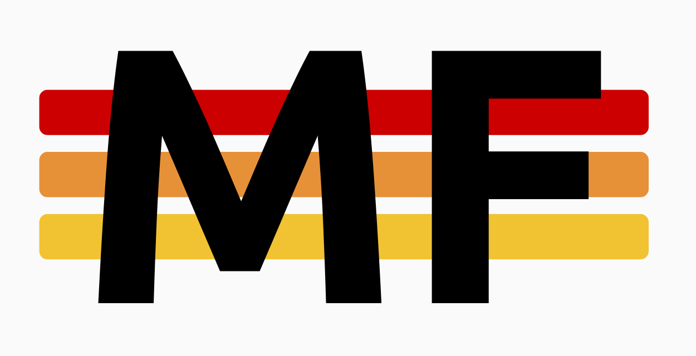

# MF Action Board

This project was generated with [Angular CLI](https://github.com/angular/angular-cli) version 1.0.0.

## Install prereqs

If you have not done so already, install [nvm](https://github.com/creationix/nvm)

Within this project's directory, run the following commands
* nvm install
* nvm use
* npm install
* npm install -g @angular/cli

## Configuration of board

### GitHub

* Username
  * Either personal or new user that is a member of your team (we rely on GitHub team repo association to get builds!!)
* Github api token
  * account settings -> developer settings -> personal access tokens -> Generate new token
  * Select the following scope: `Full control of private repositories`
* Team ID
  * `curl -u <username>:<github-api-token> https://api.github.com/user/teams | grep '"name": "<teamname>"' -A 3`
    * i.e. `curl -u blackbaud-christophercotar:1e49ze..................... https://api.github.com/user/teams | grep '"name": "micro-cervezas"' -A 3`
  * get team id from the property `"id": <id>`
* Team Name
  * Self explanatory: `blackbaud/<teamname>`
* GitHub team repo association cleanup
  * This task is a must do if you'd like to only see builds your team owns.
  * Find someone with super admin access to GitHub and request that they remove access rights to all repos your team does not care about the builds for.  They must have super access since you can't modify collaborators of projects your team is not admins of.
    * i.e. micro-cervezas had read access to `blackbaud/alfred`. New policy is members of the blackbaud org have read access to all repos in org, this is no longer needed.

### VSTS

* Username: The login you use for VSTS, usually an email.
* Token: A personal access token set up with the correct permissions (listed below). A token can be created
  via your user's [Security](https://blackbaud.visualstudio.com/_details/security/tokens) settings.
  * `code:read`
  * `build:read`
  * `release:read`
* Team: The name of your team, which is used to determine which repos to query for.
  The team name should match what's in [`vsts-repos.ts`](https://github.com/blackbaud/mf-action-board/blob/master/src/github/services/vsts-repos.ts). In the future this will likely be a dropdown.

## Development server

Run `ng serve` for a dev server. Navigate to `http://localhost:4200/`. The app will automatically reload if you change any of the source files.

## Deployment to S3 bucket
* Get keys from Eric Slater or Colby M. White
  * use the `awscli` to put keys in `~/.aws/credentials` in a `[mf-action-board]` profile
  * `aws configure --profile=mf-action-board`
* Run `npm run deploy`
* deployment URI: `http://mf-action-board.s3-website.us-east-2.amazonaws.com`

## Code scaffolding

Run `npm generate component component-name` to generate a new component. You can also use `ng generate directive/pipe/service/class/module`.

## Build

Run `npm build` to build the project. The build artifacts will be stored in the `dist/` directory. Use the `-prod` flag for a production build.

## Running unit tests

Run `npm test` to execute the unit tests via [Karma](https://karma-runner.github.io).

## Running end-to-end tests

Run `npm e2e` to execute the end-to-end tests via [Protractor](http://www.protractortest.org/).
Before running the tests make sure you are serving the app via `ng serve`.

## Further help

To get more help on the Angular CLI use `ng help` or go check out the [Angular CLI README](https://github.com/angular/angular-cli/blob/master/README.md).
